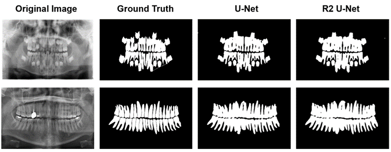
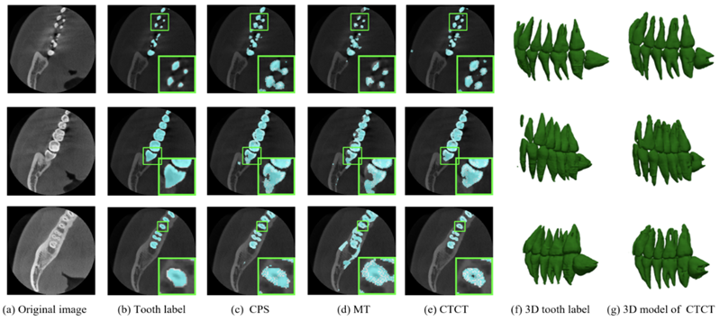
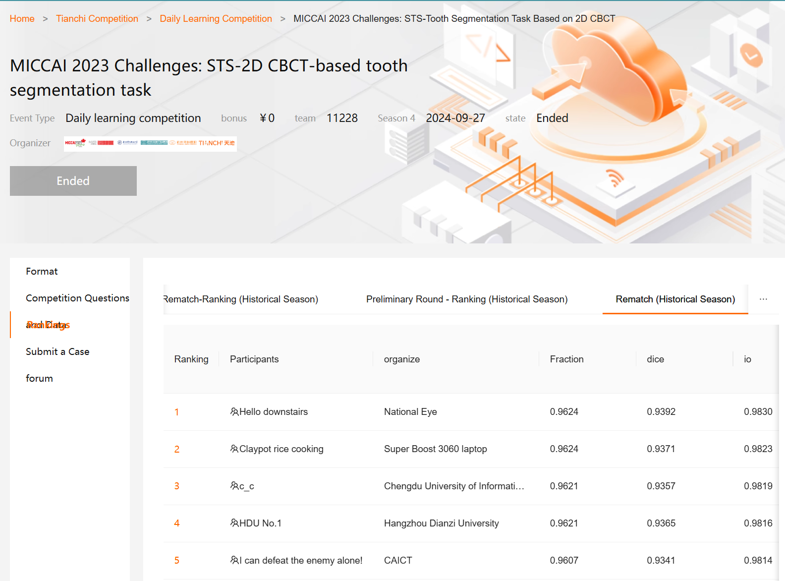
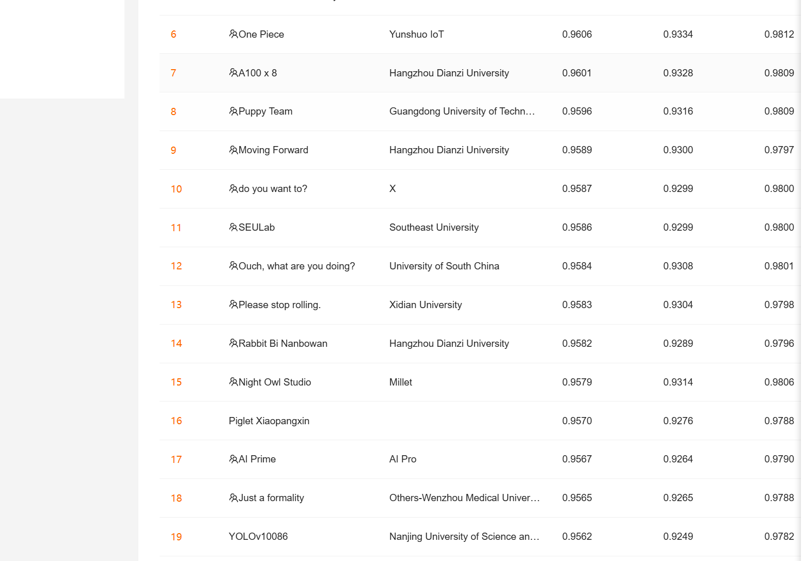
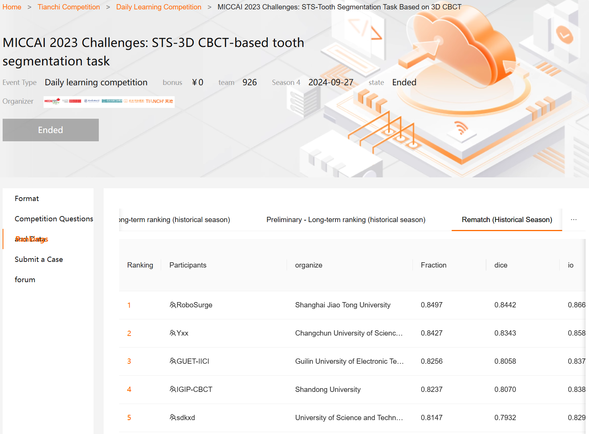
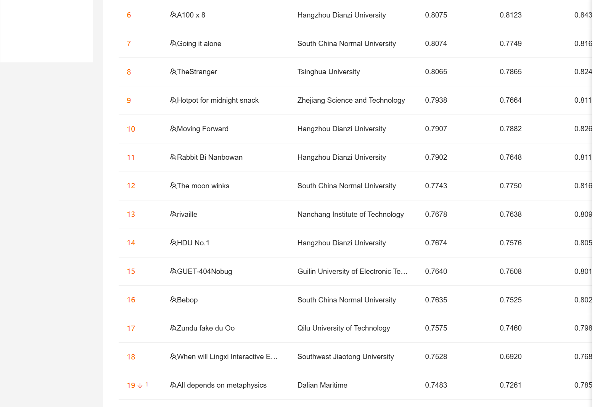

# MICCAI 2023 STS Dental Segmentation Challenge 🦷

**Official Repository for Tooth Segmentation Challenges**
| [2D Track Introduction ](https://tianchi.aliyun.com/competition/entrance/532086/introduction)| [3D Track Introduction ](https://tianchi.aliyun.com/competition/entrance/532087/introduction)| [Leaderboard ](https://chat.qwen.ai/c/3ef31cf1-b5e3-4656-bced-6b162bb8fb3f#🏆-challenge-leaderboard)|

------

## 🔍 **Challenge Overview**

This challenge aims to advance dental segmentation techniques in both **2D panoramic radiography** and **3D CBCT** domains. Two tracks are designed to address critical clinical needs:

| **Track**    | **Task**                                  | **Evaluation Metrics**           | Link                                                         |
| ------------ | ----------------------------------------- | -------------------------------- | ------------------------------------------------------------ |
| **2D Track** | Tooth segmentation on 2D panoramic images | Dice, IoU, Hausdorff Distance    | https://tianchi.aliyun.com/competition/entrance/532086/rankingList |
| **3D Track** | Tooth segmentation on 3D CBCT volumes     | Dice, IoU, 3D Hausdorff Distance | https://tianchi.aliyun.com/competition/entrance/532087/rankingList |

### 2D Track



### 3D Track



------

## 🏆 **Technical reports and codes of Top participants**

### **2D Track Top 7**

| Rank | Team ID        | Technical Report                                             | Code                                                         |
| ---- | -------------- | ------------------------------------------------------------ | ------------------------------------------------------------ |
| 1    | louxianihao       | [Read Report](participants/2D-第一名-楼下你好.md)             | [Download Code](https://pan.baidu.com/s/15bVgpJ1juWX3r_rvVaAyeQ?pwd=z2py) |
| 2    | baozaifan     | [Read Report](participants/2D-第二名-煲仔饭在煲-技术报告.pdf) | [Download Code](https://pan.baidu.com/s/15bVgpJ1juWX3r_rvVaAyeQ?pwd=z2py) |
| 3    | c_c            | [Read Report](participants/2D-第三名-c_c技术说明(中文).pdf)   | [Download Code](https://pan.baidu.com/s/15bVgpJ1juWX3r_rvVaAyeQ?pwd=z2py) |
| 4    | HDU one       | [Read Report](participants/2D-第四名-HDU%20NO.1-技术说明.docx) | [Download Code](https://pan.baidu.com/s/15bVgpJ1juWX3r_rvVaAyeQ?pwd=z2py) |
| 5    | podi | [Read Report](participants/2D-第五名-我一人便可破敌-技术说明.docx) | [Download Code](https://pan.baidu.com/s/15bVgpJ1juWX3r_rvVaAyeQ?pwd=z2py) |
| 6    | One Piece      | [Read Report](participants/2D-第六名-One%20Piece-技术说明.docx) | [Download Code](https://pan.baidu.com/s/15bVgpJ1juWX3r_rvVaAyeQ?pwd=z2py) |
| 7    | A100x8         | [Read Report](participants/2D-第七名-A100x8-技术说明.docx)    | [Download Code](https://pan.baidu.com/s/15bVgpJ1juWX3r_rvVaAyeQ?pwd=z2py) |

### **3D Track Top 7**

| Rank | Team ID   | Technical Report                                                       | Code                                                         |
| ---- | --------- | ----------------------------------------------------------- | ------------------------------------------------------------ |
| 1    | RoboSurge | [Read Report](participants/3D-第一名-RoboSurge-技术说明.pdf) | [Download Code](https://pan.baidu.com/s/1C3l6fN0Z1G256C6LaDGICQ?pwd=wsje) |
| 2    | Yxx       | [Read Report](participants/3D-第二名-Yxx-技术说明-中文.pdf)  | [Download Code](https://pan.baidu.com/s/1C3l6fN0Z1G256C6LaDGICQ?pwd=wsje) |
| 3    | GUET-IICI | [Read Report](participants/3D-3-GUET-IICI-技术说明_中文.pdf) | [Download Code](https://pan.baidu.com/s/1C3l6fN0Z1G256C6LaDGICQ?pwd=wsje) |
| 4    | IGIP-CBCT | [Read Report](participants/3D-第4名-IGIP-CBCT-技术说明.docx) | [Download Code](https://pan.baidu.com/s/1C3l6fN0Z1G256C6LaDGICQ?pwd=wsje) |
| 5    | sdkxd     | [Read Report](participants/3D-第五名-sdkxd.docx)             | [Download Code](https://pan.baidu.com/s/1C3l6fN0Z1G256C6LaDGICQ?pwd=wsje) |
| 6    | A100x8    | [Read Report](participants/3D-第六名-A100x8-技术说明.docx)   | [Download Code](https://pan.baidu.com/s/1C3l6fN0Z1G256C6LaDGICQ?pwd=wsje) |
| 7    | solo      | [Read Report](participants/3D-第7名-单打独斗-技术说明.docx)  | [Download Code](https://pan.baidu.com/s/1C3l6fN0Z1G256C6LaDGICQ?pwd=wsje) |

------

### Leaderboard

**2D Leadboard**





**3D Leadboard**





## 📁 **Dataset & Resources**

### **2D Track**

- **Training** : 2,000 labeled panoramic images (500 with masks)
- **Test** : 1,500 unlabeled images (500 initial + 1,000 final)
- Evaluation :

  - Dice = ∣*A*∣+∣*B*∣2∣*A*∩*B*∣
  - IoU = ∣*A*∪*B*∣∣*A*∩*B*∣
  - 2D Hausdorff Distance = min(∣*x*1−*x*2∣+∣*y*1−*y*2∣)
  - Final Score = 0.4×Dice+0.3×IoU+0.3×(1−Normalized Hausdorff)

### **3D Track**

- **Training** : 312 CT scans (12 labeled, 300 unlabeled)

- **Test** : 50 CT scans (labels withheld)

- **Submission** : `.nii.gz` volume masks

- Evaluation :

  - 3D Hausdorff Distance = min(∣*x*1−*x*2∣+∣*y*1−*y*2∣+∣*z*1−*z*2∣)
- Scoring formula identical to 2D track

------

## 🧾 **Organizers & Collaborators**

### **Host Institutions**

- Zhejiang University of Media and Communications
- Hangzhou Dianzi University

### **Data Providers**

- Hangzhou Dental Group
- London Queen Mary University
- University of Electronic Science and Technology of China

### **Organizing Committee**

- Prof. Yaqi Wang (ZUMC)
- Prof. Xingru Huang (HDU)
- Prof. Weirui Cui (QMUL)
- Prof. Shuai Wang (HDU)
- Dr. Xiaodiao Chen (HDU)

------

## 📂 **Repository Structure**

```
STS-Challenge/
├── documentation/           # Technical specs & rulebooks  
├── participants/            # Team submissions (code/Report/presentation)  
│   └── Team-ID/           # Team-specific materials  
├── assets/                  # Visual assets (dataset examples, workflow diagrams)  
└── README.md                # This file  
```

------

## 📞 **Contact**

- **Email** : [SemiTeethSegChallenge@outlook.com](mailto: SemiTeethSegChallenge@outlook.com)
- **WeChat Group** : [Join via official website](https://tianchi.aliyun.com/competition/entrance/532087/introduction)

------

## Reference 

```
[1] Cui, W., Wang, Y., Zhang, Q., Zhou, H., Song, D., Zuo, X., ... & Zeng, L. (2022, August). CTooth: a fully annotated 3d dataset and benchmark for tooth volume segmentation on cone beam computed tomography images. In Intelligent Robotics and Applications: 15th International Conference, ICIRA 2022, Harbin, China, August 1–3, 2022, Proceedings, Part IV (pp. 191-200). Cham: Springer International Publishing.

[2] Cui, W., Wang, Y., Li, Y., Song, D., Zuo, X., Wang, J., ... & Zhang, Q. (2022, September). CTooth+: A Large-Scale Dental Cone Beam Computed Tomography Dataset and Benchmark for Tooth Volume Segmentation. In Data Augmentation, Labelling, and Imperfections: Second MICCAI Workshop, DALI 2022, Held in Conjunction with MICCAI 2022, Singapore, September 22, 2022, Proceedings (pp. 64-73). Cham: Springer Nature Switzerland.
```


## 📜 **License**

This project is released under the [MIT License ](https://chat.qwen.ai/c/LICENSE).

------

